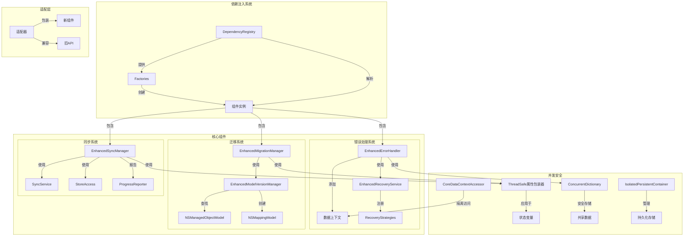
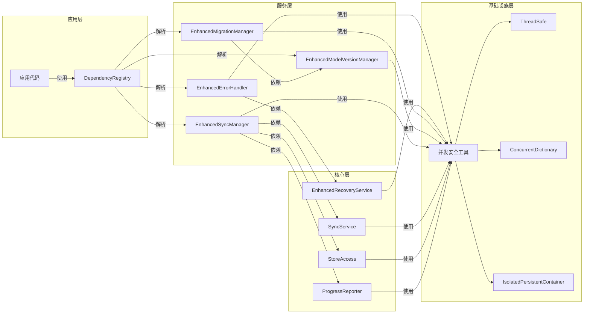
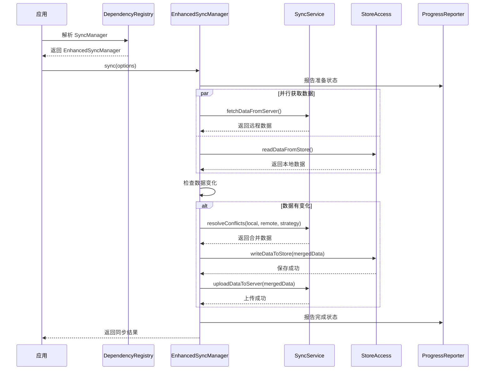
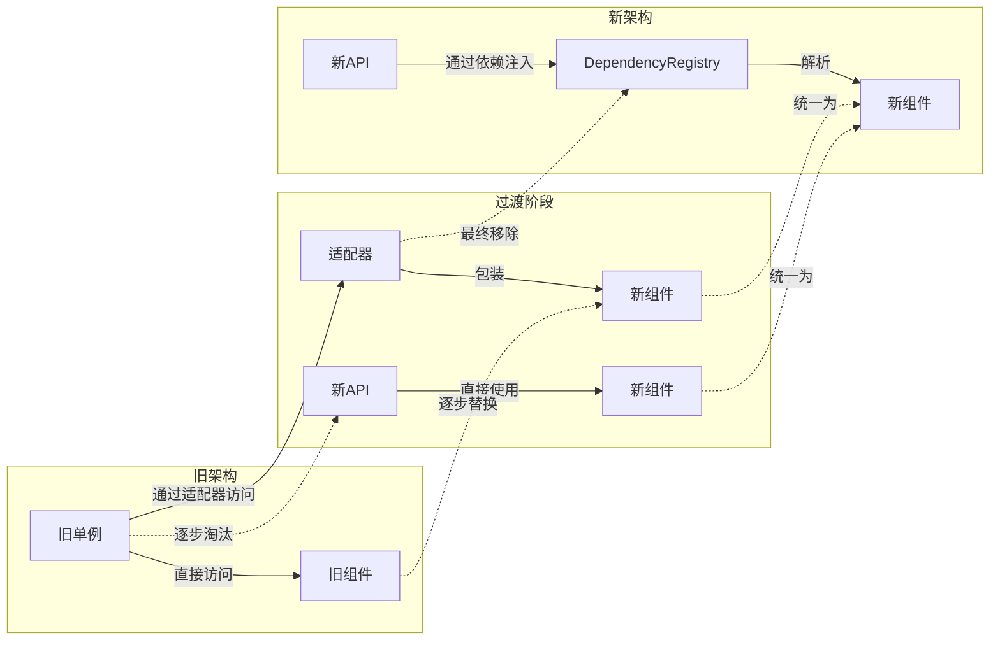

# 优化架构设计

## 架构总览

以下是我们新架构的总体设计图，展示了主要组件及其关系：



## 组件依赖关系



## 数据流



## 迁移策略



## 并发安全性设计

```mermaid
graph TD
    subgraph "并发安全原则"
        direction LR
        P1[使用Swift协议隔离] --> Design
        P2[优先值类型] --> Design
        P3[Actor隔离] --> Design
        P4[避免共享可变状态] --> Design
        Design[安全设计]
    end
    
    subgraph "工具使用"
        TS[ThreadSafe属性包装器] --> |应用于| SV[状态变量]
        CD[ConcurrentDictionary] --> |替代| Dict[普通Dictionary]
        IPC[IsolatedPersistentContainer] --> |替代| PC[PersistentContainer]
        RAP[ResourceAccessProtocol] --> |抽象| RA[资源访问]
    end
    
    subgraph "迁移方法"
        SM1[识别@preconcurrency使用点] --> SM2[应用并发安全工具]
        SM2 --> SM3[编写并发测试]
        SM3 --> SM4[验证并回归测试]
        SM4 --> SM5[移除@preconcurrency]
    end
```

## 设计原则

1. **依赖注入**: 所有组件通过依赖注入获取依赖，而不是直接创建或使用单例
2. **协议抽象**: 使用协议定义组件接口，实现可替换性和可测试性
3. **值类型优先**: 优先使用结构体而非类，减少共享状态和内存管理问题
4. **并发安全**: 使用专门的并发工具确保线程安全，避免数据竞争
5. **适配器模式**: 通过适配器提供向后兼容性，实现渐进式迁移
6. **单一职责**: 每个组件只负责一项功能，避免大型多功能类 