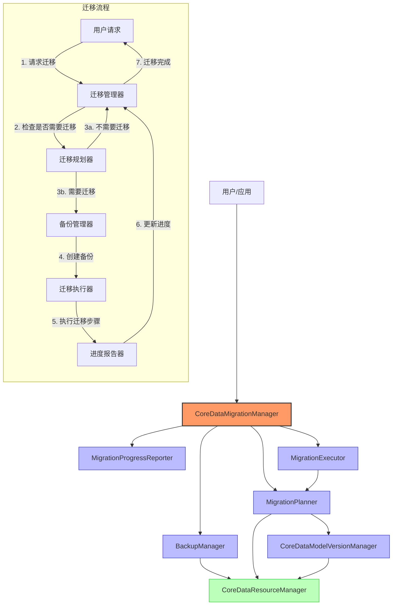
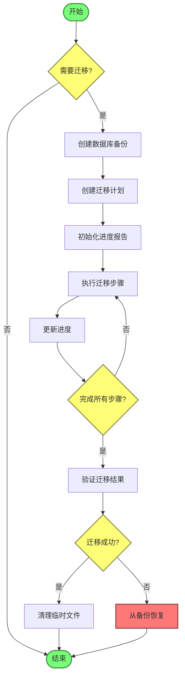
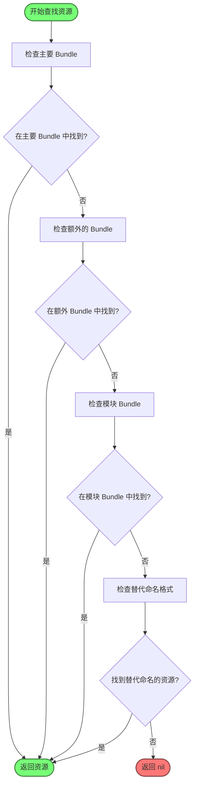

# CoreData 迁移架构图表

本文档使用 Mermaid 图表展示 CoreData 迁移架构中各组件之间的关系和数据流。

## 组件关系图

## 数据流图

## 组件职责表

| 组件 | 主要职责 | 与其他组件的关系 |
|------|---------|-----------------|
| CoreDataMigrationManager | 协调整个迁移过程 | 使用其他所有组件 |
| MigrationProgressReporter | 报告迁移进度 | 被 MigrationManager 使用 |
| BackupManager | 管理备份和恢复 | 使用 ResourceManager，被 MigrationManager 使用 |
| MigrationPlanner | 规划迁移路径 | 使用 ResourceManager 和 ModelVersionManager，被 MigrationManager 和 Executor 使用 |
| MigrationExecutor | 执行迁移步骤 | 使用 MigrationPlanner，被 MigrationManager 使用 |
| CoreDataModelVersionManager | 管理模型版本 | 使用 ResourceManager，被 MigrationPlanner 使用 |
| CoreDataResourceManager | 管理 CoreData 资源 | 被其他组件使用 |

## CoreDataResourceManager 的资源查找算法

## 总结

CoreData 迁移架构采用了模块化的设计，明确划分了各组件的职责，确保了迁移过程的安全性和可靠性。CoreDataResourceManager 作为基础组件，通过灵活的资源查找算法，支持在模块化环境中可靠地工作。