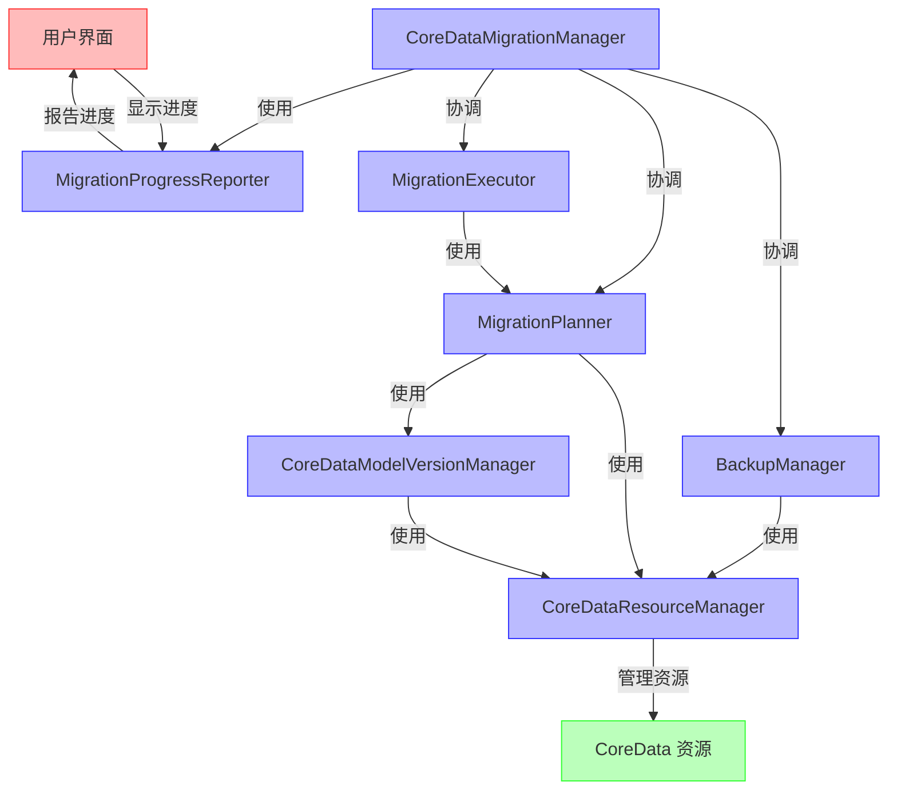

```mermaid
graph TD
    %% 定义节点
    UI[用户界面] -- 显示进度 --> PR
    MM[CoreDataMigrationManager] -- 协调 --> BM
    MM -- 协调 --> MP
    MM -- 协调 --> ME
    MM -- 使用 --> PR
    
    BM[BackupManager] -- 使用 --> RM
    MP[MigrationPlanner] -- 使用 --> RM
    MP -- 使用 --> VM
    ME[MigrationExecutor] -- 使用 --> MP
    PR[MigrationProgressReporter] -- 报告进度 --> UI
    
    VM[CoreDataModelVersionManager] -- 使用 --> RM
    RM[CoreDataResourceManager] -- 管理资源 --> Res[CoreData 资源]
    
    %% 样式
    classDef manager fill:#f9f,stroke:#333,stroke-width:2px;
    classDef component fill:#bbf,stroke:#33f,stroke-width:1px;
    classDef resource fill:#bfb,stroke:#3f3,stroke-width:1px;
    classDef ui fill:#fbb,stroke:#f33,stroke-width:1px;
    
    class MM,BM,MP,ME,PR,VM,RM component;
    class Res resource;
    class UI ui;
``` 